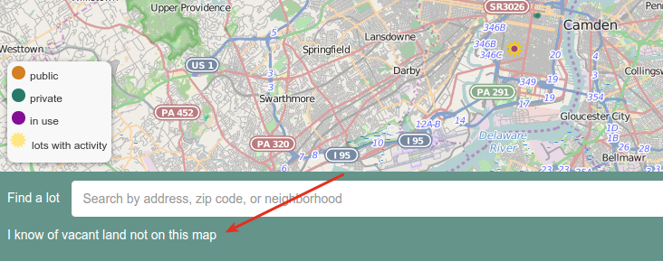
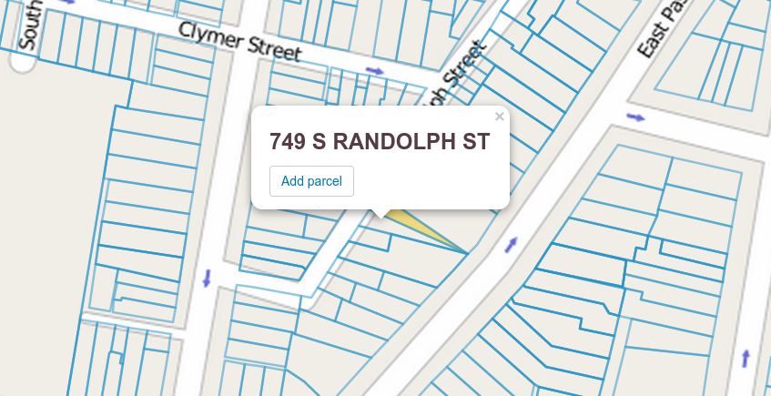

# Friendly Owners

The **friendly owner** parts of a Living Lots site are where the people who 
live in neighborhoods can suggest land that does not already exist in our data
is vacant and should be added to our data.

Unlike [groundtruthing](groundtruth) which involves people correcting existing
data (ie by saying "this isn't actually vacant"), **friendly owners** are
inherently places that are **not** already in our data&mdash;it's how we find out
about new places people can organize around!

The name "friendly owner" comes from the original use of this functionality.
When it was first written, the only use case was owners of land suggesting that
we add their land to our data to give communities a way to find out about it.

## What is a friendly owner?

A friendly owner contains the contact information for the person who suggested
the land be added to our data (name, email, phone number, etc) and, importantly,
the **parcel** that the person is suggesting.

## How is a friendly owner added?

A friendly owner is added when someone fills out a friendly owner form.
Depending on how Living Lots is configured, this for may not be enabled or will
be accessed in a variety of ways. For example, in Grounded in Philly there is a
link under the search bar:

Once the link is clicked, all parcels will be overlaid on the map. The person
adding the entry selects a parcel, enters their contact information, and submits
their suggestion.

## What happens when a friendly owner is added?

The site will automatically send the facilitator an email. Nothing else happens
until the facilitator approves it. This way someone can't suggest that the
entire city is actually one large vacant lot!

Once the facilitator approves the friendly owner, the lot will be added to the
map.
