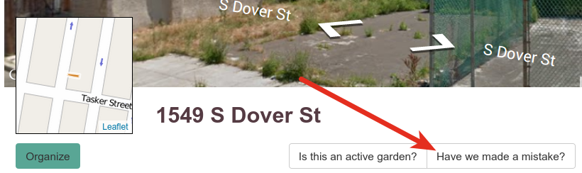
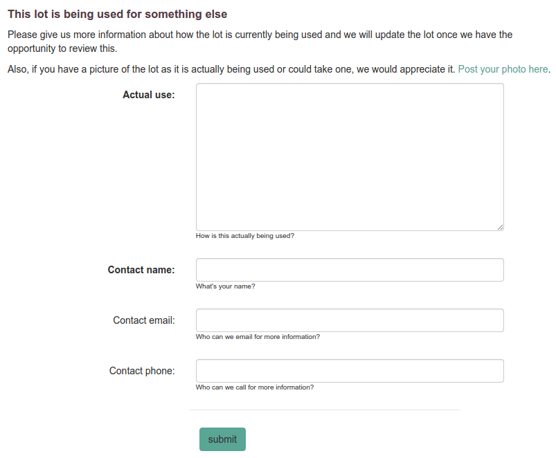

# Groundtruth

The **groundtruth** parts of a Living Lots site are where the people who live
in neighborhoods can correct our conception of how the land is being used there.
This is important because otherwise we're almost always starting with automated
and imperfect data.

## What is a groundtruth record?

A **groundtruth record** tells the facilitator of a Living Lots site that
someone would like to make a correction to the [known use](lots/#editing-lots)
in the system for a lot. 

## How is a groundtruth record added?

A groundtruth record is added to a lot when someone clicks the **Have we made a
mistake?** button on a lot and fills in that form.

*(Lot pages and groundtruth buttons will vary depending on your site.)*

The form will vary based on your site, but generally it gives people a
structured way to tell the facilitator that the lot in question is actually
being used and gives the facilitator a way to get in touch with the person
creating the record, just in case:

## What happens when a groundtruth record is added?

The site will automatically send the facilitator an email. Nothing else happens
until the facilitator approves it. This way someone can't randomly go through
your database and say that nothing is vacant!

Once the facilitator approves the groundtruth record, the lot will be given a
[known use](lots/#editing-lots) that will remove the lot from the map.
