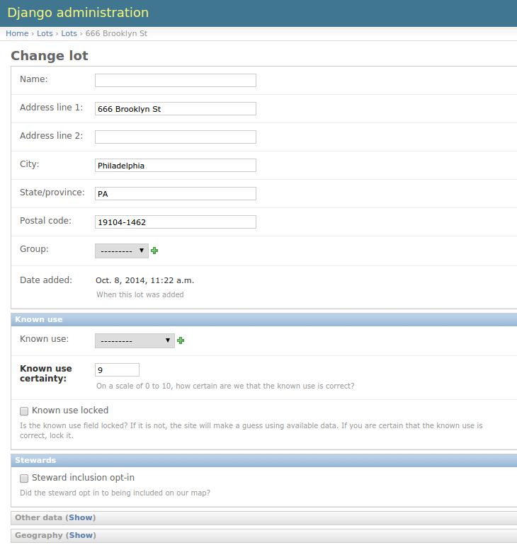

# Lots

Living Lots revolves around lots, parcels of land that have been pulled into the
Living Lots system. Once a lot exists it should show up on the map and have its
own page. People can:

 * add content (**notes**, **pictures**, and **files**) to a lot,
 * [**organize**](organize) a lot,
 * [**groundtruth**](groundtruth) a lot (make a correction to the use we have recorded for it),
   and
 * [**steward**](stewards) a lot once they have access to it.

## Editing lots

When you edit a lot it should look similar to the following:

Many of these fields are self-explanatory. We'll cover a few here, though.

### Known use

These fields all deal with how we think a lot is being used currently, on the
ground:

 * **known use**: How is the lot currently being used? If this is empty the lot
   is assumed to be vacant.
 * **known use certainty**: How sure are we that the **known use** we have set
   for the lot is correct? If a lot is marked as having no known use but the 
   certainty is low, it will not be shown publicly.
 * **known use locked**: There are automated bits of 

### Stewards

 * **steward inclusion opt-in**: Did the steward that is on the lot opt in to
   being shown publicly on the map?

    There are some cases where a steward would want to mark a lot as being in 
    use but not show their project publicly. When the steward adds their project
    (through a [steward notification](stewards)), they will check or uncheck a 
    field that says something like **Include on map?**, and that will check or 
    uncheck this field, respectively.
