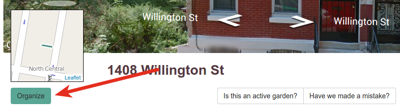
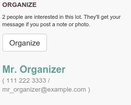

# Organizing

## What is an organizer?

When someone is interested in [stewarding](stewards) a project on a lot, they 
should add themselves as an **organizer** on that lot. Organizers can be public
or private, and in addition to showing that there is activity on a lot, the
organizer is subscribed to that lot. They will hear about content added to the
lot such as new **notes**, **photos**, and **files**.

## How is an organizer added?

An organizer is added to a lot when someone clicks the **Organize** button on
the lot's page:

*(Lot pages and organize buttons will vary depending on your site.)*

## What happens when an organizer is added?

When an organizer is added, the site will automatically:

 * email the facilitator for the Living Lots site,
 * email all current organizers on the lot,
 * *if the organizer is public*, post the organizer on the lot's page:

    

    *A public organizer on a lot's page. As you can see, there are other 
    (private) organizers that are not shown.*
