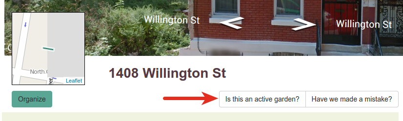

# Stewards

## What is a steward?

When a [lot](lots) is being used by a group, we say that the group is
*stewarding* that lot. This is represented by a **steward project** in the 
system. Depending on the situation, you might more likely call a "steward
project" a "community garden" or something similar, but here we opt for the
former as it is more generic.

## How is a steward added?

Before a steward project is created, a **steward notification** is created when
someone enters the information for the project online from a lot's page.

A steward notification is created once someone clicks this button and fills out
the form that follows:

Stewards are *moderated*, so they won't show up instantly. The facilitator for
your Living Lots site will get an email when someone adds themself and once that
is approved the steward project will be added to the lot.
